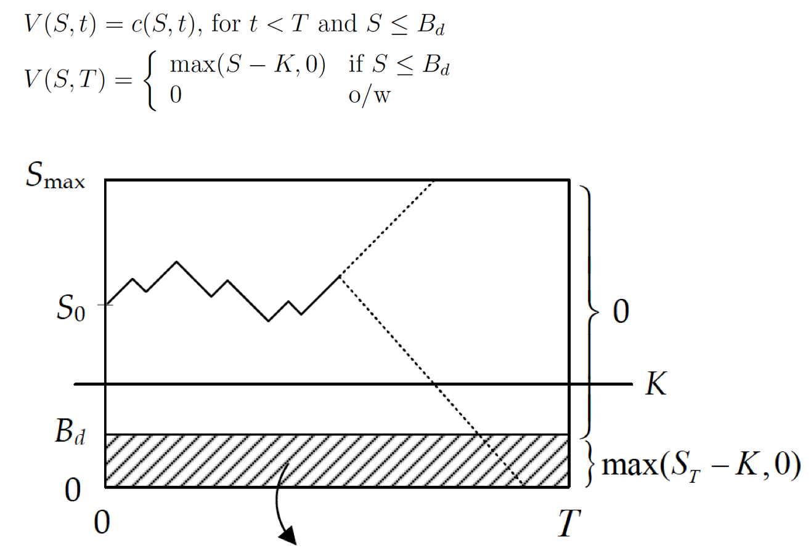
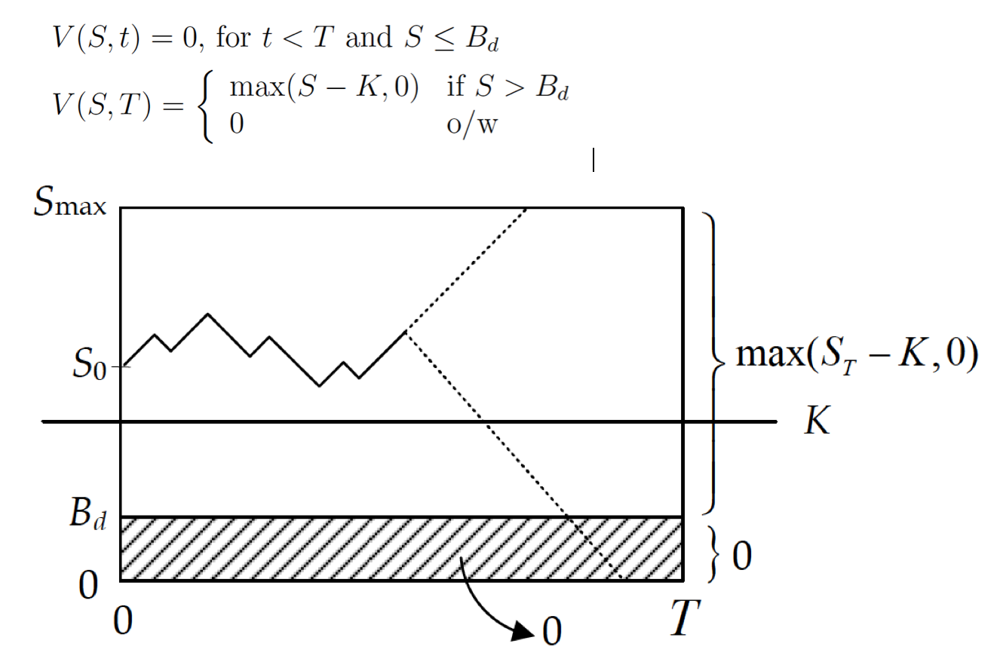

```{r setup, include = FALSE}
# Set knitr options
knitr::opts_chunk$set(echo = TRUE, message = FALSE, warning = FALSE)

library(igraph)
library(readr)
library(dplyr)
library(tidyr)
library(knitr)
library(ggplot2)
library(fExoticOptions)
```

# Introduction
To be written

# Data Preparation

**Step 1** - Load the data
```{r step_1}
#Reading data

```


# CVA pricing

## Part i
Write your own Black Scholes function and price [= CBS] a simple call option with the following
inputs:
```{r}

```

## Part ii
Implement a Geometric Brownian Motion (GBM) for the Equity underlying process
```{r}

```

## Part iii
Use your Black Scholes function and the paths derived in the previous step to
```{r}

```

## Part iv
Use the MtM distributions from the previous step [a matrix (13110000) is expected] and calcu-
late the Expected Exposure (EE), the Potential Future Exposure (PFE) at 95% confidence level
and the CVA price using the following counterparty spread curve:
```{r}

```

## Part v
Now add a second option trade in the portfolio.
```{r}

```


# Option pricing

## Definition of Barrier Options

Barrier options are pathdependent options, with payoffs that depend on the price of the underlying asset at expiration and whether or not the asset price crosses a barrier during the life of the option [1]. There are two categories or types of Barrier options: "knock-in" and "knock-out". "Knock-in" or "in" options are paid for up front, but you do not receive the option until the asset price crosses the barrier. "Knock-out" or "out" options come into existence on the issue date but becomes worthless if the asset price hits the barrier before the expiration date. If the option is a knock-in (knock-out), a predetermined cash rebate may be paid at expiration if the option has not been knocked in (knocked-out) during its lifetime. [1] 

According to when options can be exercised, they are classified into mainly three groups; European, Bermudan and American Options. American options can be exercised at any time up to the expiration date, whereas European options can be exercised only on the expiration date itself. Bermudan options are similar in style to American options regarding the possibility of early exercise. However, the difference is the fact that a Bermudan option has predetermined discrete exercise dates [2].

**Down-and-in call option**
```{r store_graph_1, out.width = 300, out.height= 300, fig.retina = NULL, fig.align='center', fig.cap="Figure 1: Down-and-in Barrier Options [3]"}

```

**Down-and-out call option**

```{r store_graph_2, out.width = 300, out.height= 300, fig.retina = NULL, fig.align='center', fig.cap="Figure 2: Down-and-out Barrier Options [3]"}

```

**In-out parity**

European vanilla option = European knock-out option + European knock-in option [3]

* Suppose an investor holds both a knock-out option and a knock-in option. If the stock
price never touches the barrier, the knock-out option will provide the same payoff as that
of a vanilla option at maturity. When the stock price touches the barrier, the knock-out
option becomes worthless and the knock-in option are enabled and providing the same
payoff as that of a vanilla option at maturity.

* Since the combined payoff of a knock-out option and a knock-in option are the same
as that of a vanilla option at maturity, their values today should be equal. This result is
termed as “in-out parity.”

* Alternative method to price knock-in options:
Since it needs more computational effort to price a knock-in option, it is possible to price
a knock-out option with the same barrier first, and then apply the in-out parity to derive
the value of the knock-in option.

## Method 1 - Monte Carlo Method 

The procedures of applying monte carlo method on barrier options pricing is summarised below:

* Step 1 - Simulate random paths with GBM process for the spot value until maturity T.
* Step 2 - Decide whether each path is knocked in or out and thus determine the final payoff of each path.
* Step 3 - Calculate the payoff at maturity. 
* Step 4 - Discount all future payoff distribution of values to t0.
* Step 5 - Calculate the mean of discounted payoff distribution.

```{r monte_carlo_option_pricing_}
#########################################
# Step 0 - Define initial/valuation input
#########################################
#Set seed for random numbers
set.seed(12345)
# Simulation period 
T<-0.5
# Step in y with 360 day-count convention
tStep<-1/(360*2)
# Scenarios
nPaths<-10000
#Evaluation times in units of year  
time<-seq(0,T,tStep)

# Parameters (S0, vola, drift)	
start_value<-100
# yearly vola
vola<-0.25
# yearly drift
drift<-0
# Strike price
strike<-90
# Annualized rate of interest
r <-0.01
# Annualized cost-of-carry rate
b <-0.01
# Barrier Value
H <- 75

#######################################################################################
# Step 1 - Simulate random paths with GBM process for the spot value until maturity T.
#######################################################################################
#Definition of the RF box	
RF_GBM<-matrix(0,nrow=nPaths,ncol=length(time))

#We generate random numbers N(0,1)
#Always better to generate the innovations in a vectorial fashion and then "distribute" them
pass_rand<-rnorm(nPaths*(length(time)-1))
pass_rand<-matrix(pass_rand,nrow=nPaths,ncol=(length(time)-1))
pass_rand<-scale(pass_rand,center = TRUE,scale = TRUE)
#Adding the starting value
pass_rand<-cbind(rep(0,nPaths),pass_rand)
#Accrueting the innovations
pass_rand<-t(apply(pass_rand,1,cumsum))
#drift_matrix: x=x0*exp(mu*t-vola^2*t/2)*exp(vola*N(0,1)*sqrt(t))
pass_drift<-matrix(rep(exp(-0.5*time*vola^2+time*drift),nPaths),nrow=nPaths,ncol=length(time),
                   byrow=TRUE)
#Generation of the paths (scaling the random component by tStep)
RF_GBM<-start_value*exp(pass_rand*vola*sqrt(tStep))*pass_drift
rownames(RF_GBM)<-paste("history",as.character(seq(1,nPaths,1)),sep="")
colnames(RF_GBM)<-paste(as.character(time),"y",sep="")	

par(mfrow=c(1,1))
matplot(time,t(RF_GBM)[,1:100],type="l",xlab="t(y)",ylab="RF",main="GBM process")
points(time,apply(t(RF_GBM),1,mean),type="l",col=1,lwd=4)
points(time,apply(t(RF_GBM),1,quantile,0.05),type="l",col=2,lwd=4)
points(time,apply(t(RF_GBM),1,quantile,0.95),type="l",col=2,lwd=4)
grid()

#########################################################
# Step 2 - Decide whether each path is knocked in or out 
# and thus determine the final payoff of each path.
#########################################################
#Vanilla Opiton
RF_GBM_vanilla <- RF_GBM

#Exotic Option - down-and-in
RF_GBM_di <- RF_GBM[RF_GBM[,ncol(RF_GBM)]<H,]

#Exotic Option - down-and-out
RF_GBM_do <- RF_GBM[RF_GBM[,ncol(RF_GBM)]>=H,]

############################################
# Step 3 - Calculate the payoff at maturity. 
############################################
#Vanilla Opiton
payoff_vanilla <- pmax(RF_GBM_vanilla[,ncol(RF_GBM_vanilla)] - strike,0)

#Exotic Option - down-and-in
payoff_di <- pmax(RF_GBM_di[,ncol(RF_GBM_di)] - strike,0)

#Exotic Option - down-and-out
payoff_do <- pmax(RF_GBM_do[,ncol(RF_GBM_do)] - strike,0)

###################################################################
# Step 4 - Discount all future payoff distribution of values to t0.
###################################################################
#Vanilla Opiton
discounted_payoff_vanilla <- exp(-r*T)*payoff_vanilla

#Exotic Option - down-and-in
discounted_payoff_di <- exp(-r*T)*payoff_di

#Exotic Option - down-and-out
discounted_payoff_do <- exp(-r*T)*payoff_do

################################################################
# Step 5 - Calculate the mean of discounted payoff distribution.
################################################################
#Vanilla Opiton
price_vanilla <- mean(discounted_payoff_vanilla)

#Exotic Option - down-and-in
price_di <- mean(discounted_payoff_di)

#Exotic Option - down-and-out
price_do <- mean(discounted_payoff_do)
```


```{r results_comparison}
# Check: vanilla option price = knock-out option price + knock-in option price 
print(paste0("The price of vanilla option is ", price_vanilla))
print(paste0("The price of exotic down-and-in option is ", price_di))
print(paste0("The price of exotic down-and-out option is ", price_do))
```

The sum of prices of down-and-in and down-and-out options doesn't seem to agree with the price of vanilla option

## Method 2 - R package fExoticOptions

The definitions of the variables required in the StandardBarrierOption function are explained below [1].

* S is the asset price, a numeric value

* X is the exercise price, a numeric value

* H is the barrier value, a numeric value

* Time is the time to maturity measured in years, a numeric value; e.g. 0.5 means 6 months

* r is the annualized rate of interest, a numeric value; e.g. 0.25 means 25% pa

* b is the the annualized cost-of-carry rate, a numeric value; e.g. 0.1 means 10% pa.

* sigma is the annualized volatility of the underlying security, a numeric value; e.g. 0.3
means 30% volatility pa

* K for an "In"-Barrier a prespecified cash rebate which is paid out at option expiration
if the option has not been knocked in during its lifetime,for an "Out"-Barrier a prespecified cash rebate which is paid out at option expiration if the option has not been knocked out before its lifetime, a numerical value

```{r fExoticOptions_out}

StandardBarrierOption(TypeFlag = "cdo", S = 100, X = 90,H = 75, K = 0, Time = 0.5, r=0.01, b = 0.01, sigma = 0.25)

```

The price of the down-and-out call option is 13.4761 where a prespecified cash rebate is assumed to be 0.

```{r fExoticOptions_in}
StandardBarrierOption(TypeFlag = "cdi", S = 100, X = 90,H = 75, K = 0, Time = 0.5, r = 0.01, b = 0.01, sigma = 0.25)
```

The price of the down-and-in call option is 0.0202 where a prespecified cash rebate is assumed to be 0.

## Part 3 - Evaluation of methods

**Question:** StandardBarrierOption assumes a continuous monitoring of the barrier instead of the discrete one (i.e. the time grid) of your Monte Carlo. Does this affect your Monte Carlo price? Is the difference between the Monte Carlo prices and the closed form solution affected by both Monte Carlo noise and the type of the barrier monitoring? Please comment.

In simulation, due to the inability of Monte Carlo to simulate in continuous time, an option is priced under the assumption that it has Bermudan style, and thus only discrete exercise opportunities exist. So for example, if an American option is exercisable at any time t where 0 ≤ t ≤ T , we restrict the option such that it can be exercised only at a fixed set of exercise opportunities 0 < t1 < t2 < . . . < td, where d is the number of exercisable time steps.


# Backtesting
## Part 1
```{r}

```

## Part 2
```{r}

```

## Part 3
```{r}

```


# Reference
* [1] "Options Basics: What Are Options? | Investopedia." Investopedia. Ed. Staff .. Investopedia. Investopedia, 02 Dec. 2003. Web. 02 June 2016.
* [2] Longstaff, F A and Schwartz, E S, 2001, ”Valuing American Options by Simulation: A Simple Least-Squares Approach”, Review of Financial Studies, Vol. 14, No. 1, pp. 113-147.
* [3] Birge, John R., and Vadim Linetsky. Financial Engineering. Amsterdam: North-Holland, 2008. Print.

